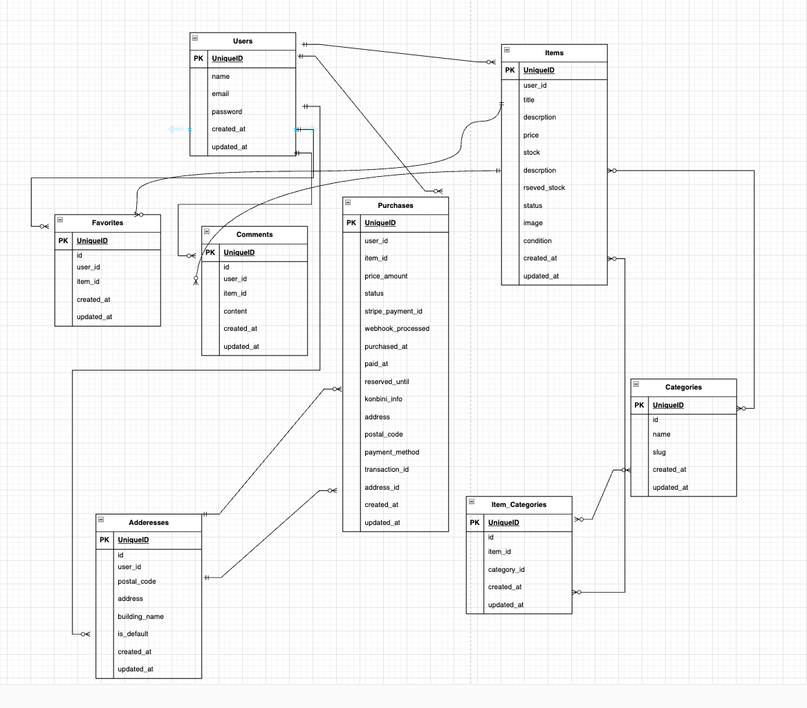

# フリマアプリ

## 環境構築
**Dockerビルド**
1. `git clone git@github.com:git@github.com:coachtech-material/mock-case.git`
2. cd mock-case
3. DockerDesktopアプリを立ち上げる
4. `docker-compose up -d --build`

> *MacのM1・M2チップのPCの場合、`no matching manifest for linux/arm64/v8 in the manifest list entries`のメッセージが表示されビルドができないことがあります。
エラーが発生する場合は、docker-compose.ymlファイルの「mysql」内に「platform」の項目を追加で記載してください*
``` bash
mysql:
    platform: linux/x86_64(この文追加)
    image: mysql:8.0.26
    environment:
```

**Laravel環境構築**
1. `docker-compose exec php bash`
2. `composer install`
3. 「.env.example」ファイルを 「.env」ファイルに命名を変更。または、新しく.envファイルを作成
4. .envに以下の環境変数を追加
``` text
DB_CONNECTION=mysql
DB_HOST=mysql
DB_PORT=3306
DB_DATABASE=laravel_db
DB_USERNAME=laravel_user
DB_PASSWORD=laravel_pass
```
5. アプリケーションキーの作成
``` bash
php artisan key:generate
```
6. Fortifyのインストール
``` bash
php composer require laravel/fortify
php php artisan vendor:publish --provider="Laravel\Fortify\FortifyServiceProvider"
```

7. マイグレーションの実行
``` bash
php artisan migrate
```

8. Fortifyの設定
app.phpの修正
ローカルの変更
サービスプロバイダの追加
FortifyServiceProvider.phpの修正
RouteServiceProvider.phpの修正
日本語ファイルのインストール
``` bash
php composer require laravel-lang/lang:~7.0 --dev
php cp -r ./vendor/laravel-lang/lang/src/ja ./resources/lang/
```

9. シーディングの実行
``` bash
php artisan db:seed
```

10. Stripe決済導入
``` bash
php composer require stripe/stripe-php
```
11. .envに以下の環境変数を追加
``` text
STRIPE_SECRET=sk_test_xxxxxxxx
STRIPE_PUBLIC=pk_test_xxxxxxxx
STRIPE_WEBHOOK_SECRET=whsec_xxxxxxxx
```
12. サービス設定（config/services.php）
``` text
'stripe' => [
    'secret' => env('STRIPE_SECRET'),
    'public' => env('STRIPE_PUBLIC'),
    'webhook_secret' => env('STRIPE_WEBHOOK_SECRET'),
    'api_version' => env('STRIPE_API_VERSION', null),
],
```
13. Webhook の受信
``` text
# ローカルでLaravelサーバ起動
docker-compose exec php bash
php artisan serve --host=0.0.0.0 --port=8000

# Stripe CLI でリッスン
stripe login
stripe listen --forward-to http://localhost:8000/webhook/stripe
```
14. テストカード
``` text
カード決済：4242 4242 4242 4242（有効期限未来、CVC任意）
```

## 使用技術(実行環境)
- PHP8.4.4
- Laravel8.83.8
- MySQL8.0.26
- Stripe API

## ER図


## URL
- 開発環境：http://localhost/
- phpMyAdmin:：http://localhost:8080/
